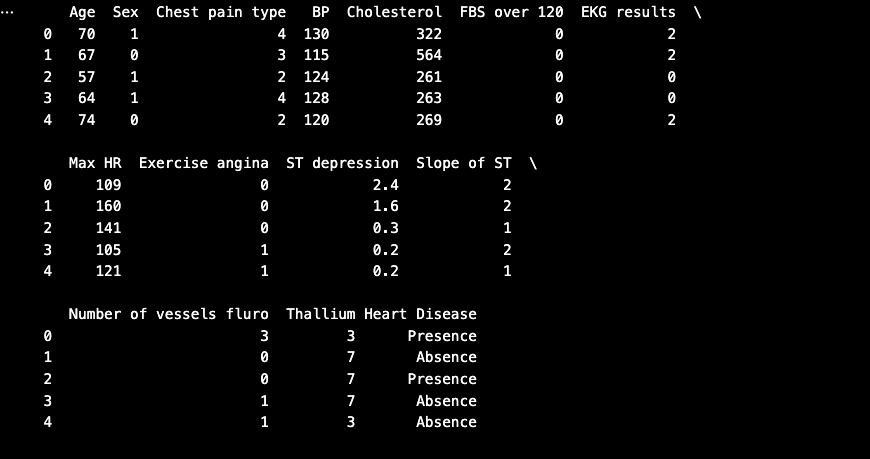
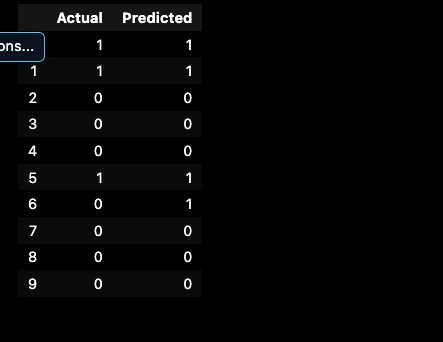

# Task 2: Linear Regression from Scratch

## Objective

The objective of this project is to implement the Linear Regression algorithm from scratch using Python and NumPy without using the Scikit-Learn library. The project demonstrates how to manually calculate the slope, intercept, predictions, and Mean Squared Error (MSE), along with visualizing the regression line.

---

## Dataset

A simple manually created dataset is used for this project.

| Input (X) | Output (Y) |
|-----------|------------|
| 1 | 3 |
| 2 | 5 |
| 3 | 7 |
| 4 | 9 |
| 5 | 11 |

This dataset follows the equation:

```
Y = 2X + 1
```

---

## Technologies Used

- Python 3
- NumPy
- Matplotlib
- Visual Studio Code

---

## Team Members

- SHAIK KHAJA MASTAN

---

## Screenshots

### Output


### Visualization


---

## How to Run the Project

### 1. Clone the repository

```bash
git clone <repository-link>
```

### 2. Open the project folder

```bash
cd T-2_LinearRegression
```

### 3. Install the required libraries

```bash
pip install numpy matplotlib
```

### 4. Run the program

```bash
python linear_regression.py
```

---

## Expected Output

```
Input (x): [1 2 3 4 5]
Output (y): [ 3  5  7  9 11]

Slope (m): 2.0
Intercept (b): 1.0

Predicted Values:
[ 3.  5.  7.  9. 11.]

Mean Squared Error:
0.0
```

A graph displaying the original data points and the regression line will also be generated.

---

## Project Structure

```
T-2_LinearRegression/
│
├── linear_regression.py
├── README.md
└── Screenshots/
    ├── output.png
    └── graph.png
```

---

## Conclusion

This project successfully implements Linear Regression from scratch using Python and NumPy. It manually calculates the slope, intercept, predicted values, and Mean Squared Error (MSE) without using Scikit-Learn. The visualization confirms that the regression line perfectly fits the dataset.


---

# Task 3: Heart Disease Prediction using Logistic Regression

## Objective

The objective of this project is to develop a Machine Learning classification model using the **Logistic Regression** algorithm to predict whether a patient has heart disease based on medical information. The project demonstrates the complete machine learning workflow, including data preprocessing, model training, prediction, and performance evaluation.

---

## Dataset

The project uses the **Heart Disease Prediction Dataset**, which contains **270 patient records** with **14 attributes**, including **13 input features** and **1 target variable**.

### Target Variable

| Value | Description               |
| ----: | ------------------------- |
|     1 | Presence of Heart Disease |
|     0 | Absence of Heart Disease  |

---

## Technologies Used

* Python
* Pandas
* Scikit-learn
* Jupyter Notebook
* Visual Studio Code

---

## Team Member

* Ramya

---

## Project Workflow

1. Load the Heart Disease Prediction dataset.
2. Perform data preprocessing.
3. Split the dataset into training and testing sets.
4. Train the Logistic Regression model.
5. Predict heart disease on test data.
6. Evaluate the model using accuracy score.
7. Compare actual and predicted values.

---

## Screenshots

### Dataset Preview



### Model Accuracy


### Prediction Results



---

## How to Run

### Clone the repository

```bash
git clone <repository-link>
```

### Open the project folder

```bash
cd Week-2-ML-Projects-AI-ASCENDERS
```

### Install the required libraries

```bash
pip install pandas scikit-learn
```

### Open the Notebook

Open the following notebook using **Visual Studio Code** or **Jupyter Notebook**:

```text
Week2_Classification_Sprint/code/classification_model.ipynb
```

Run all the notebook cells sequentially.

---

## Expected Output

```text
Heart Disease Prediction using Logistic Regression

Algorithm Used : Logistic Regression

Model Accuracy : 92.59%
```

The trained model predicts whether a patient has heart disease and displays the overall prediction accuracy.

---

## Project Structure

```text
Week2_Classification_Sprint/
│
├── code/
│   └── classification_model.ipynb
│
├── data/
│   └── Heart_Disease_Prediction.csv
│
└── screenshots/
    ├── dataset_preview.png
    ├── model_accuracy.png
    └── prediction_results.png
```

---

## Conclusion

This project successfully implements a **Logistic Regression** model for heart disease prediction. After preprocessing the dataset and training the model, the classifier achieved an **accuracy of 92.59%**. The project demonstrates the complete workflow of a binary classification problem using Python and Scikit-learn.
