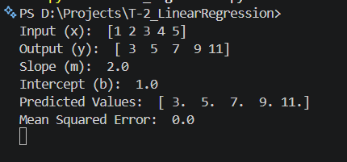
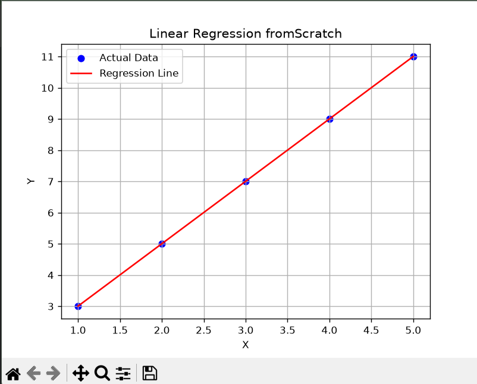

# Task 2: Linear Regression from Scratch

## Objective

The objective of this project is to implement the Linear Regression algorithm from scratch using Python and NumPy without using the Scikit-Learn library. The project demonstrates how to manually calculate the slope, intercept, predictions, and Mean Squared Error (MSE), along with visualizing the regression line.

---

## Dataset

A simple manually created dataset is used for this project.

| Input (X) | Output (Y) |
|-----------|------------|
| 1 | 3 |
| 2 | 5 |
| 3 | 7 |
| 4 | 9 |
| 5 | 11 |

This dataset follows the equation:

```
Y = 2X + 1
```

---

## Technologies Used

- Python 3
- NumPy
- Matplotlib
- Visual Studio Code

---

## Team Members

- SHAIK KHAJA MASTAN

---

## Screenshots

### Output



### Visualization



---

## How to Run the Project

### 1. Clone the repository

```bash
git clone <repository-link>
```

### 2. Open the project folder

```bash
cd T-2_LinearRegression
```

### 3. Install the required libraries

```bash
pip install numpy matplotlib
```

### 4. Run the program

```bash
python linear_regression.py
```

---

## Expected Output

```
Input (x): [1 2 3 4 5]
Output (y): [ 3  5  7  9 11]

Slope (m): 2.0
Intercept (b): 1.0

Predicted Values:
[ 3.  5.  7.  9. 11.]

Mean Squared Error:
0.0
```

A graph displaying the original data points and the regression line will also be generated.

---

## Project Structure

```
T-2_LinearRegression/
│
├── linear_regression.py
├── README.md
└── Screenshots/
    ├── output.png
    └── graph.png
```

---

## Conclusion

This project successfully implements Linear Regression from scratch using Python and NumPy. It manually calculates the slope, intercept, predicted values, and Mean Squared Error (MSE) without using Scikit-Learn. The visualization confirms that the regression line perfectly fits the dataset.